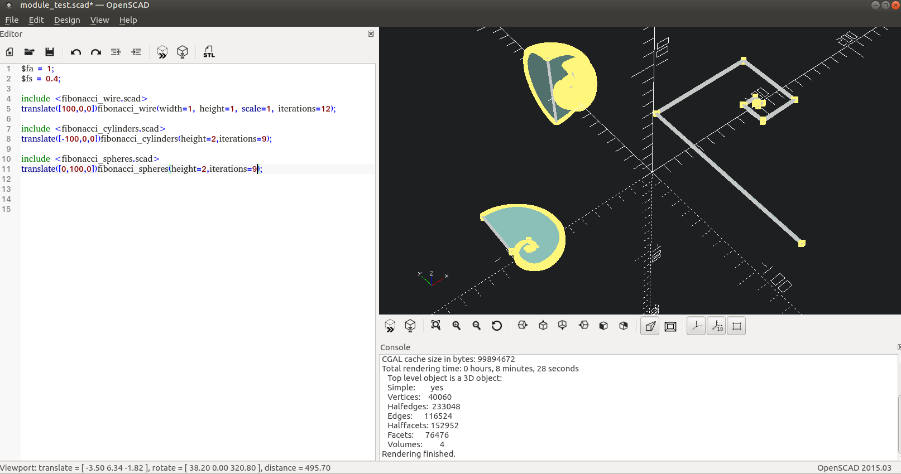

# scad_self_study
OpenSCAD self study code backup

## Notes

### Recursion and scoping limits 
I choosed to model fibonacci serias as toy problem and first I tried to make fibonacci wire model in a recursive manner.
I failed to do so with the OpenSCAD programming language, so I made a python script `fibonacci_1.py`, which makes a `fibonacci_1.scad`.
There I found that the scoping limit is 10 and after it the inner scopes just wont render.

### Could you turtle?
No. At least I can not. It seems it you want to have move and rotate the current origo, it seems to be easier to do so in a another language.  
The end result of that testing can be seen from `translated_fibonac_4.py` and `translated_fibonac_4.scad`.

### What happens in the modules, stays in the modules
I transformed `translated_fibonac_4.scad` into the `fibonacci_wire.scad` module. Maybe I use it later on.
While doing so I found out that if you have errors on the module, you can not see those on the uning module. It just does not render.

### Sphere and cylinder rendering performance
After a hour of copypaste coding I had transformed `fibonacci_wire.scad` into `fibonacci_cylinders.scad` and `fibonacci_spheres.scad` modules.
The cylindes seem to render fine, but the sphere eats a lot of CPU. If you want to model spheres, you dont maybe want to use OpenSCAD.

### Some pages I had to read
 * https://en.wikibooks.org/wiki/OpenSCAD_Tutorial
 * https://en.wikipedia.org/wiki/Denavit%E2%80%93Hartenberg_parameters
 * https://en.wikipedia.org/wiki/Euler%E2%80%93Rodrigues_formula
 * https://en.wikipedia.org/wiki/Fibonacci_number